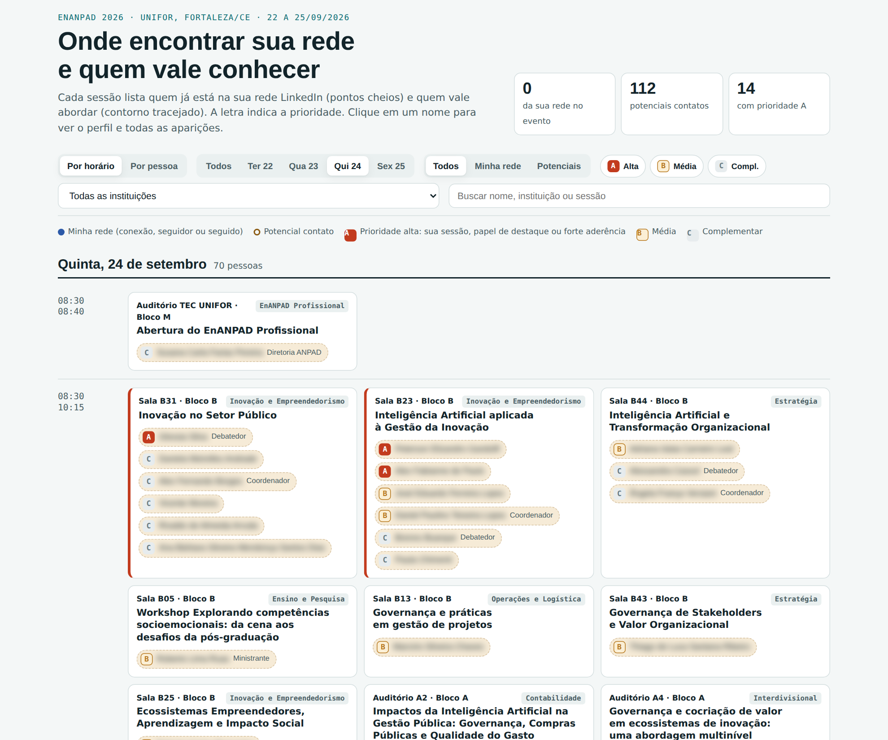

# Radar de rede em eventos acadêmicos

Pipeline reprodutível que cruza a **programação de um evento acadêmico** com a **rede LinkedIn de um pesquisador**. Ele gera:

- um **painel HTML** que mostra, por dia, horário e sala, onde estarão os contatos da rede e os potenciais contatos, com prioridade **A/B/C**;
- uma **planilha Excel** com os dois grupos, pronta para acompanhar abordagens e convites.

O projeto é genérico: serve para qualquer pesquisador e para qualquer evento com programação em PDF. Traz como exemplo a Programação Detalhada do **EnANPAD 2026** (`agendas/enanpad-2026/`).

## Como funciona

| Etapa | Script | Entrada | Saída |
|---|---|---|---|
| 1. Extrair agenda | `scripts/01_extrair_agenda.py` | PDFs da programação | `dados/agenda.json` |
| 2. Exportar rede (no navegador) | `scripts/02_exportar_rede_linkedin.js` | sua conta LinkedIn | `dados/rede_linkedin.json` |
| 3. Cruzar rede x agenda | `scripts/03_cruzar_rede.py` | agenda + rede | `dados/cruzamento.json` |
| 4. Pontuar potenciais contatos | `scripts/04_pontuar_potenciais.py` | agenda + cruzamento + config | `dados/potenciais.json` |
| 5. Gerar painel e planilha | `scripts/05_gerar_painel_e_planilha.py` | tudo acima | `saida/painel.html`, `saida/rede_evento.xlsx` |

`PROMPT.md` descreve o mesmo processo em linguagem natural, para que um assistente de IA o reconstrua ou adapte a outro evento.

## Requisitos

- Python 3.9+ e `pip install -r requirements.txt` (openpyxl)
- `pdftotext` (pacote poppler-utils; no Windows, pelo Xpdf/Poppler ou WSL)
- Navegador com a sua conta LinkedIn aberta (apenas para a etapa 2)

## Passo a passo

1. **Configure.** Copie `config/config.exemplo.json` para `config/config.json` e ajuste:
   - `pesquisador.nome_na_agenda`: seu nome exatamente como aparece na programação. Deixe em branco se não for participar.
   - `aderencia`: expressões (sem acentos, em minúsculas) que descrevem os seus temas de pesquisa.
   - `pesos` e `cortes`: calibre até a prioridade A ter entre 25 e 40 pessoas.
2. **Extraia a agenda:** `python3 scripts/01_extrair_agenda.py`
3. **Exporte a sua rede:** abra a página de seguidores do LinkedIn, cole `scripts/02_exportar_rede_linkedin.js` no console do navegador (F12) e mova o `rede_linkedin.json` baixado para `dados/`. Essa etapa é opcional: sem ela, o painel mostra só os potenciais contatos.
4. **Execute o restante:** `./executar_tudo.sh`, ou os scripts 03 a 05 em sequência.
5. **Revise:**
   - Confira na planilha os casos "Provável" e "A verificar".
   - Registre as decisões em `config/revisao_manual.csv` (modelo em `revisao_manual.exemplo.csv`).
   - Se quiser, informe perfis localizados em `config/perfis_localizados.json`.
   - Rode de novo as etapas 3 a 5.
6. **Abra** `saida/painel.html` no navegador.

## O painel

- **Por horário:** dia, faixa de horário e cartões de sessão. As pessoas aparecem como pílulas: cheias para a rede, tracejadas para os potenciais, com a letra da prioridade. Sessões com alguém de prioridade A ganham uma faixa lateral, e as suas sessões ficam destacadas.
- **Por pessoa:** lista ordenada por prioridade, com a próxima aparição e a marcação "já abordei", salva no navegador.
- **Filtros:** dia, grupo, prioridade, instituição (lista suspensa com todas as instituições) e busca. Ao clicar em um nome, abre uma ficha com o perfil, a ação sugerida e todas as aparições.

## Outro evento

Coloque os PDFs em `agendas/<evento>/` e aponte `evento.pasta_agenda` no config. O parser foi calibrado para o layout da ANPAD. Em outros layouts, ajuste em `01_extrair_agenda.py` os padrões de papel (`PAPEIS`), código de trabalho (`RE_CODIGO`) e horário (`RE_HORA`), e confira uma amostra da extração.

## Privacidade e uso responsável

- `dados/`, `saida/` e os arquivos pessoais de `config/` estão no `.gitignore`. **Não publique a sua rede nem o painel com nomes reais.** Para divulgar, use capturas com nomes borrados.
- A etapa 2 usa apenas as listas que você já vê na sua própria rede. Respeite os Termos de Uso do LinkedIn e mantenha as pausas entre requisições.
- Convites em lote: até cerca de 25 por dia e 100 por semana, sempre conferindo o nome antes de enviar.

## Licença

Código sob licença MIT. Os PDFs da programação pertencem à ANPAD e são reproduzidos apenas para fins de reprodutibilidade (ver `agendas/enanpad-2026/LEIA-ME.md`).
